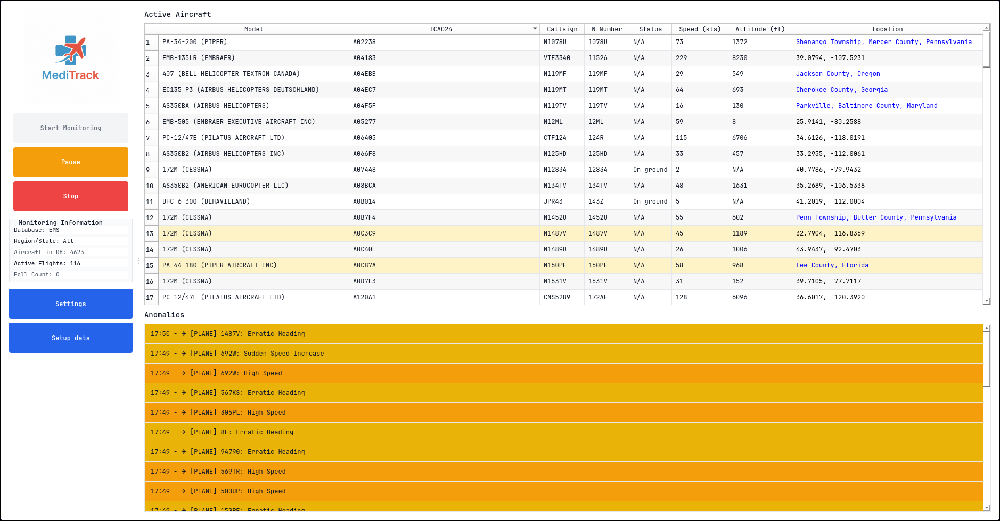
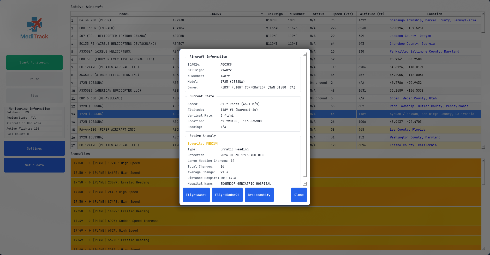

# MediTrack

<p align="center">
  
</p>

Track and monitor EMS and Police/Law Enforcement aircraft in the US using the [OpenSky Network](https://opensky-network.org) API. Identifies aircraft from the FAA registry and flags unusual flight patterns (speed, altitude, squawks, multi-launch).

## Features

- **EMS & Police**: Filter FAA registry by model, owner keywords, and N-number; monitor both databases.
- **Anomaly detection**: High speed, rapid climb/descent, emergency squawks, erratic heading, multiple launches.
- **Geo context**: Suppresses false positives near airports (e.g. landings); enriches alerts with hospital proximity.
- **Regional**: Monitor by US region or state(s). GUI and CLI.

## Screenshots

<p align="center">
  
</p>
<p align="center"><em>Monitoring dashboard — active aircraft, anomalies, and controls</em></p>

<p align="center">
  
</p>
<p align="center"><em>Setup data — FAA download and build EMS & Police databases</em></p>

## Quick start

```bash
pip install -r requirements.txt
```

1. **Download the FAA registry** (required once)
   - Get the Releasable Aircraft ZIP: [FAA Releasable Aircraft Download](https://www.faa.gov/licenses_certificates/aircraft_certification/aircraft_registry/releasable_aircraft_download) (~60 MB).
   - Or direct: [ReleasableAircraft.zip](https://registry.faa.gov/database/ReleasableAircraft.zip)
   - Extract it so the **ReleasableAircraft** folder (with `MASTER.txt` and `ACFTREF.txt`) is **inside** your MediTrack project folder (same level as `data/` and `src/`).

2. **Build the aircraft databases**
   - **GUI**: Run the app, click **Setup data**, then **Build EMS & Police databases**.
   - **CLI** (EMS: JSON + CSV + SQLite; Police: JSON):
     ```bash
     python3 src/create_ems_database.py
     python3 src/filter_police_aircraft.py
     ```
   - Outputs go to `data/` (e.g. `ems_aircraft.json`, `police_aircraft.json`).

3. **Run**
   - **GUI**: `python3 src/run_gui.py` (or `python3 -m gui.main` from `src/`).
   - **CLI**: `python3 src/run_monitor.py --database ems --region west --interval 60`

## OpenSky API (optional but recommended)

Better rate limits with an account. Create [OpenSky account](https://opensky-network.org/accounts/login), then add credentials:

- **credentials.json** in project root:
  ```json
  { "client_id": "your-client-id", "client_secret": "your-client-secret" }
  ```
- Or `.env`: `OPENSKY_CLIENT_ID=...`, `OPENSKY_CLIENT_SECRET=...`

## Configuration

Key settings in `config.py` or `.env`:

- **Anomaly**: `ANOMALY_SPEED_THRESHOLD_KNOTS`, `ANOMALY_RAPID_DESCENT_FT`, etc.
- **Geo**: `GEO_NEAR_AIRPORT_KM`, `GEO_NEAR_HOSPITAL_KM` (default 10).
- **Paths**: `AIRPORTS_CSV`, `HOSPITALS_CSV` (default: `us-airports.csv`, `Hospitals.csv` in project root).

Place **us-airports.csv** (OurAirports) and **Hospitals.csv** in the project root for airport/hospital proximity; see Setup data in the GUI if you use it to build DBs.

## Project layout

- `data/` — Generated DBs (`ems_aircraft.json`, `police_aircraft.json`, etc.), cache, logs.
- `ReleasableAircraft/` — FAA files (`MASTER.txt`, `ACFTREF.txt`) after you extract the ZIP.
- `src/` — Filters, `create_ems_database.py`, OpenSky client, monitor, anomaly detector, GUI.
- `mediModels.txt` — EMS model list used by the EMS filter.

## Data sources

- [FAA Releasable Aircraft](https://registry.faa.gov/database/ReleasableAircraft.zip) — registration data.
- [OpenSky Network](https://opensky-network.org) — real-time ADS-B states.

## License

Use in line with OpenSky API terms and FAA data policies. Please be aware this program can produce false positives for both anomalies and flagged aircrafts.  

---

**Special thanks to** the OpenSky Network, FAA Public Flight Registry, and Lindsay Blanton from Broadcastify for providing the list of country codes.
