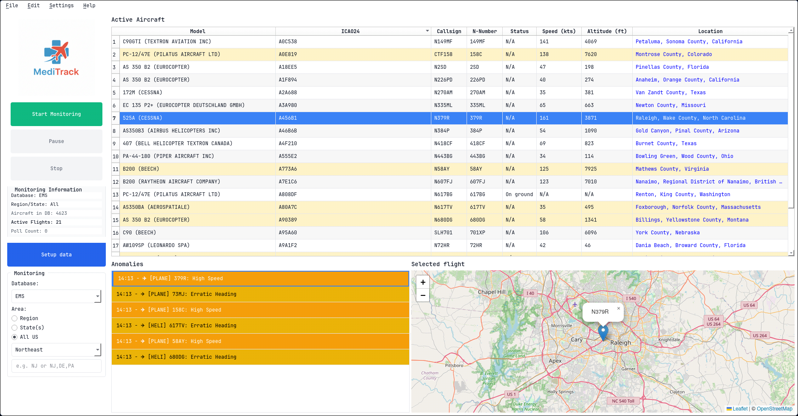
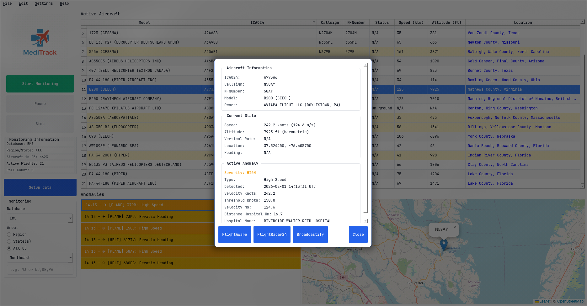

# MediTrack

<p align="center">
  
</p>

Track and monitor EMS and Police/Law Enforcement aircraft in the US using the [OpenSky Network](https://opensky-network.org) API. Identifies aircraft from the FAA registry and flags unusual flight patterns (speed, altitude, squawks, multi-launch).

See [CHANGELOG.md](CHANGELOG.md) for recent changes and [CONTRIBUTING.md](CONTRIBUTING.md) if you want to help.

## Features

- **EMS & Police**: Filter FAA registry by model, owner keywords, and N-number with weighted scoring and confidence tiers.
- **Owner tags**: Colored chips in the main list (Police, EMS, Hospital, City, County, and others) derived from the registrant name after filtering.
- **Starred aircraft**: Click ☆ on any active flight to pin it in a persistent starred panel and on the map across database and region changes.
- **Anomaly detection**: High speed, sudden speed increase, rapid climb/descent, emergency squawks, erratic heading, multiple launches.
- **Geo context**: Suppresses false positives near airports (e.g. landings); enriches alerts with hospital proximity.
- **Regional**: Monitor by US region or state(s). GUI and CLI.
- **Dashboard**: Dark mode, map fullscreen, column visibility, exports, and links to FlightAware / FlightRadar24 / Broadcastify from the aircraft detail dialog.

## Screenshots

<p align="center">
  
</p>
<p align="center"><em>Monitoring dashboard — active aircraft, anomalies, map, and sidebar controls</em></p>

<p align="center">
  
</p>
<p align="center"><em>Starred aircraft panel with live map tracking</em></p>

<p align="center">
  
</p>
<p align="center"><em>Aircraft detail dialog with active anomaly and tracking links</em></p>

## Quick start

```bash
pip install -r requirements.txt
```

1. **Download the FAA registry** (required once)
   - Get the Releasable Aircraft ZIP: [FAA Releasable Aircraft Download](https://www.faa.gov/licenses_certificates/aircraft_certification/aircraft_registry/releasable_aircraft_download) (~60 MB).
   - Or direct: [ReleasableAircraft.zip](https://registry.faa.gov/database/ReleasableAircraft.zip)
   - Extract it so the **ReleasableAircraft** folder (with `MASTER.txt` and `ACFTREF.txt`) is **inside** your MediTrack project folder (same level as `data/` and `src/`).

2. **Build the aircraft databases**
   - **GUI**: Run the app. If no database exists yet, **Setup data** opens automatically; otherwise use **Settings → Setup data (FAA download)...**, then **Build EMS & Police databases**.
   - **CLI** (EMS: JSON + CSV + SQLite; Police: JSON):
     ```bash
     python3 src/create_ems_database.py
     python3 src/filter_police_aircraft.py
     ```
   - Outputs go to `data/` (e.g. `ems_aircraft.json`, `police_aircraft.json`).

3. **Run**
   - **GUI**: `python3 src/run_gui.py` (or `python3 -m gui.main` from `src/`).
   - Use the sidebar **Settings** button to change database, region, or states (stop monitoring first).
   - **CLI**: `python3 src/run_monitor.py --database ems --region west --interval 60`

### GUI shortcuts

| Shortcut | Action |
|---|---|
| `Ctrl+R` | Start monitoring / resume if paused |
| `Ctrl+P` | Pause / resume |
| `Ctrl+Shift+S` | Stop monitoring |
| `Ctrl+E` | Export active aircraft as CSV |
| `Esc` | Close aircraft detail dialog / exit map fullscreen |

## OpenSky API (optional but recommended)

Better rate limits with an account. Create [OpenSky account](https://opensky-network.org/accounts/login), then add credentials:

- **credentials.json** in project root:
  ```json
  { "client_id": "your-client-id", "client_secret": "your-client-secret" }
  ```
- Or `.env`: `OPENSKY_CLIENT_ID=...`, `OPENSKY_CLIENT_SECRET=...`

## Configuration

Key settings in `config.py` or `.env`:

- **Anomaly**: `ANOMALY_SPEED_THRESHOLD_KNOTS`, `ANOMALY_RAPID_DESCENT_FT`, etc.
- **Filtering**: `MIN_CONFIDENCE_LEVEL` (`low`, `medium`, `high`; default `medium`), `EXCLUDE_INDIVIDUAL_OWNERS`
- **Geo**: `GEO_NEAR_AIRPORT_KM`, `GEO_NEAR_HOSPITAL_KM` (default 10).
- **Logging**: `LOG_LEVEL` (`DEBUG`, `INFO`, `WARNING`, `ERROR`; default `INFO`).
- **Paths**: `AIRPORTS_CSV`, `HOSPITALS_CSV` (default: `us-airports.csv`, `Hospitals.csv` in project root).

Place **us-airports.csv** (OurAirports) and **Hospitals.csv** in the project root for airport/hospital proximity; the **Setup data** dialog can help download supporting files when building databases.

## Owner tags

The Tags column in the monitoring table (and the aircraft detail dialog) classifies already-filtered aircraft from the FAA owner name. Tags are display-only; they do not change scoring or who is in the database. Hover a chip to see the owner name and the keyword that matched.

Rebuild databases after you edit model or owner keyword files. Tag-only changes in `src/owner_tags.py` apply the next time you open the GUI.

## Project layout

- `data/` — Generated DBs (`ems_aircraft.json`, `police_aircraft.json`, etc.), filter config, cache, logs.
- `data/ems_models.txt`, `data/ems_owner_keywords.txt` — EMS filter patterns (see also police equivalents).
- `data/negative_owner_keywords.txt`, `data/known_operators.json` — Shared exclusions and operator allowlist.
- `ReleasableAircraft/` — FAA files (`MASTER.txt`, `ACFTREF.txt`) after you extract the ZIP.
- `src/` — Filters (`aircraft_filter/`), `owner_tags.py`, OpenSky client, monitor, anomaly detector, GUI (`starred_store.py`, `logging_config.py`).
- `mediModels.txt` — Deprecated; filter data now lives in `data/` files.

## Data sources

- [FAA Releasable Aircraft](https://registry.faa.gov/database/ReleasableAircraft.zip) — registration data.
- [OpenSky Network](https://opensky-network.org) — real-time ADS-B states.

## License

[MIT](LICENSE). Use in line with OpenSky API terms and FAA data policies. Please be aware this program can produce false positives for both anomalies and flagged aircraft.  

---

**Special thanks to** the OpenSky Network, FAA Public Flight Registry, and Lindsay Blanton from Broadcastify for providing the list of county codes.
